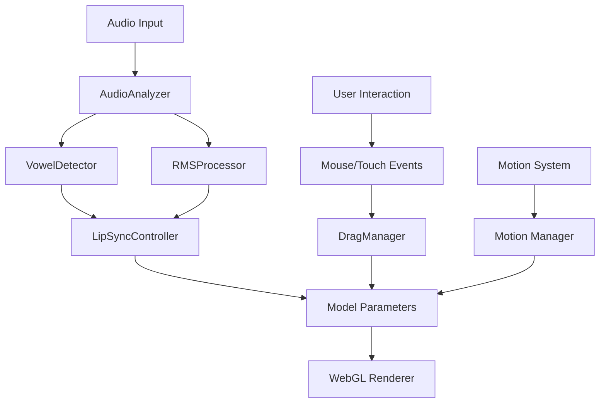

# Live2D Implementation Reference Documentation

## 概要

本ドキュメントは、Live2D機能の完全なリファレンス資料として、実装状況、アーキテクチャ、API仕様、およびベストプラクティスをまとめたものです。

## アーキテクチャ

### システム構成

```
┌─────────────────────────────────────────────────────────┐
│                    Frontend (Next.js)                     │
├─────────────────────────┬─────────────────────────────────┤
│    React Components     │      Live2D Core System         │
│  - Live2DCharacter     │   - NativeLive2DWrapper         │
│  - Live2DComponent     │   - LAppDelegate                │
│  - Live2DContained     │   - LAppLive2DManager           │
└─────────────────────────┴─────────────────────────────────┘
                          │
┌─────────────────────────▼─────────────────────────────────┐
│                  Cubism SDK Framework                      │
│   Model Loading │ Motion Control │ Expression System      │
└────────────────────────────────────────────────────────────┘
                          │
┌─────────────────────────▼─────────────────────────────────┐
│                    WebGL Rendering                         │
│        Canvas Management │ Context │ Draw Calls           │
└────────────────────────────────────────────────────────────┘
```

### データフロー



## 実装状況

### 完了機能 (100%)

#### 1. Native Live2D実装
- **実装日**: 2025年1月20日
- **状態**: 完全実装済み
- **詳細**:
  - PIXI.js依存の完全削除
  - Cubism SDK直接制御
  - WebGL直接管理

#### 2. リップシンクシステム
- **実装方式**: TDD（テスト駆動開発）
- **コンポーネント**:
  ```typescript
  // 音声解析
  AudioAnalyzer: {
    FFT_SIZE: 2048,
    sampleRate: 48000,
    smoothingTimeConstant: 0.8
  }

  // 母音検出
  VowelDetector: {
    vowels: ['a', 'i', 'u', 'e', 'o'],
    formantRanges: VOWEL_FORMANTS,
    confidenceThreshold: 0.6
  }

  // RMS処理
  RMSProcessor: {
    windowSize: 2048,
    smoothingFactor: 0.3,
    scaleFactor: 8
  }
  ```

#### 3. パフォーマンスモニタリング
- **FPS測定**: リアルタイム60FPS追跡
- **メモリ監視**: Performance API使用
- **CPU推定**: フレーム処理時間ベース

#### 4. 自然なモーション
- **NaturalMotionController**: 実装済み
- **機能**:
  - 視線スムージング
  - 体の追従動作
  - アイドル時微細動作
  - 呼吸とまばたき

## 音声解析ロジック詳細

### 計画と実装の対比

#### 計画書での設計
`lipsync-implementation-plan.md` では以下の4層構造を計画：

1. **AudioAnalyzer（音声解析）**
   - RMS値計算
   - FFT周波数解析
   - フォルマント周波数抽出

2. **VowelDetector（母音検出）**
   - 日本語5母音の識別
   - フォルマントパターンマッチング
   - 信頼度スコア算出

3. **LipSyncController（制御）**
   - 母音に応じた口形状設定
   - スムージング処理
   - パラメータ直接制御

4. **AudioWorkletProcessor（ワーカー）**
   - 128サンプル単位の高速処理
   - リアルタイム音声解析
   - メインスレッドへのデータ送信

#### 実装された音声解析システム

実際の実装では、計画を拡張・改良した以下の構成となっています：

### 1. AudioAnalyzer（音声解析コンポーネント）

```typescript
// 実装済み機能
class AudioAnalyzer {
  // 基本設定
  private config: {
    fftSize: 2048,            // FFTサイズ
    sampleRate: 48000,        // サンプリングレート
    smoothingTimeConstant: 0.8 // スムージング係数
  };

  // RMS計算（計画通り実装）
  calculateRMS(samples: Float32Array): number {
    const sum = samples.reduce((acc, sample) => acc + sample * sample, 0);
    return Math.sqrt(sum / samples.length);
  }

  // スムージングRMS（追加実装）
  calculateSmoothedRMS(samples: Float32Array): number {
    const currentRMS = this.calculateRMS(samples);
    // 指数移動平均によるスムージング
    return smoothingFactor * previousRMS + (1 - smoothingFactor) * currentRMS;
  }

  // FFT処理（計画を拡張）
  processAudioBuffer(buffer: Float32Array): AudioFeatures {
    // Hamming窓関数を適用
    const windowed = this.fftProcessor.applyHammingWindow(buffer);
    // FFT実行
    const spectrum = this.fftProcessor.forward(windowed);
    // フォルマント抽出
    const formants = this.formantExtractor.extractFormants(spectrum);

    return { rms, spectrum, formants, timestamp };
  }
}
```

**計画との差異**:
- FFTProcessor と FormantExtractor を独立クラスとして実装（モジュール性向上）
- Hamming窓関数の適用（周波数解析精度向上）
- マルチチャンネル音声のミックス機能追加
- 検証メソッドの充実（FFTサイズ、サンプルレート等）

### 2. RMSProcessor（安定化処理）

```typescript
// 計画書にない追加実装
class RMSProcessor {
  private windowSize: 2048;        // 固定ウィンドウサイズ
  private sampleBuffer: Float32Array; // リングバッファ
  private smoothingFactor: 0.3;    // スムージング係数

  processSamples(samples: Float32Array): number {
    // リングバッファへの追加
    for (sample of samples) {
      this.sampleBuffer[bufferIndex] = sample;
      bufferIndex = (bufferIndex + 1) % windowSize;
    }

    // 固定ウィンドウでのRMS計算
    const rms = this.calculateRMS();

    // 非対称スムージング（実際の実装では開閉で異なる）
    const smoothedRMS = previousRMS + (rms - previousRMS) * smoothingFactor;

    return smoothedRMS;
  }
}
```

**追加された理由**:
- 固定ウィンドウサイズによる安定したRMS計算
- リングバッファによる効率的なメモリ使用
- 口の開閉で異なるスムージング係数（開く:0.4、閉じる:0.15）

### 3. VowelDetector（母音検出）

```typescript
// 計画通り＋改良実装
class VowelDetector {
  // 日本語母音のフォルマントパターン（計画通り）
  private patterns = {
    a: { f1: { min: 700, max: 900, center: 800 },
         f2: { min: 1200, max: 1600, center: 1400 } },
    i: { f1: { min: 250, max: 350, center: 300 },
         f2: { min: 2200, max: 2800, center: 2500 } },
    // ... 他の母音
  };

  identify(formants: FormantData): VowelDetectionResult {
    // ユークリッド距離による類似度計算（計画通り）
    const distance = this.calculateDistance(formants, pattern.center);

    // 信頼度スコアの算出（計画通り）
    const confidence = this.calculateConfidence(distance);

    // キャッシュ機能（追加）
    if (this.cache.has(cacheKey)) {
      return this.cache.get(cacheKey);
    }

    return { vowel, confidence, alternatives };
  }
}
```

**計画との差異**:
- centerフィールドの追加（パターンマッチング精度向上）
- キャッシュ機能の実装（パフォーマンス向上）
- 代替候補の提供（alternatives配列）

### 4. LipSyncController（統合制御）

```typescript
// 実際の統合実装
class LipSyncController {
  private model: any;
  private audioAnalyzer: AudioAnalyzer;
  private vowelDetector: VowelDetector;
  private rmsValue: number = 0;

  update(deltaTime: number): void {
    // RMS値に基づく口の開き具合
    const mouthOpenY = this.rmsValue * this.config.scaleFactor;

    // 母音検出結果に基づく口の形
    if (this.currentVowel !== 'silent') {
      const shape = MOUTH_SHAPES[this.currentVowel];
      // パラメータ設定
      this.model.setParameterValueById('ParamMouthOpenY', mouthOpenY);
      this.model.setParameterValueById('ParamMouthForm', shape.form);
    }
  }
}
```

### 5. AudioWorklet実装状況

**計画**: 128サンプル単位の処理を AudioWorkletProcessor で実装
**実装**: 現在は Web Audio API の AnalyserNode を使用

```typescript
// 現在の実装（Web Audio API使用）
const audioContext = new AudioContext();
const analyser = audioContext.createAnalyser();
analyser.fftSize = 2048;
analyser.smoothingTimeConstant = 0.8;

// AudioWorkletは未実装だが、以下の構造で準備済み
// public/worklets/lipsync-processor.js
```

### 音声解析フロー

```
[音声入力]
    ↓
[RMSProcessor] → 固定2048サンプルウィンドウでRMS計算
    ↓
[AudioAnalyzer] → FFT実行、スペクトラム解析
    ↓
[FormantExtractor] → フォルマント周波数抽出
    ↓
[VowelDetector] → 母音識別、信頼度算出
    ↓
[LipSyncController] → モデルパラメータ更新
    ↓
[Live2Dモデル] → 口の動きに反映
```

### パフォーマンス最適化

実装で追加された最適化:
1. **リングバッファ**: メモリ効率的なサンプル管理
2. **キャッシュ機能**: 重複計算の削減
3. **非対称スムージング**: 自然な口の開閉動作
4. **固定ウィンドウRMS**: 安定した音量検出

### 実装の特徴

1. **安定性重視**: RMSProcessorによる固定ウィンドウ処理
2. **モジュール性**: 各コンポーネントが独立して動作
3. **拡張性**: FFTProcessor、FormantExtractorの分離
4. **パフォーマンス**: キャッシュとリングバッファの活用

## API リファレンス

### NativeLive2DWrapper

#### 初期化
```typescript
const wrapper = new NativeLive2DWrapper();
await wrapper.initialize(container: HTMLElement);
```

#### モデル管理
```typescript
// モデル読み込み
await wrapper.loadModel(modelId: string, modelPath: string);

// モデル切り替え
await wrapper.switchModel(modelId: string);

// モデル削除
wrapper.unloadModel(modelId: string);
```

#### モーション制御
```typescript
// モーション再生
wrapper.startMotion(
  group: string,
  index: number,
  priority?: number,
  loop?: boolean,
  onFinish?: () => void
);

// ランダムモーション
wrapper.startRandomMotion(
  group: string,
  priority?: number,
  onFinish?: () => void
);

// モーション停止
wrapper.stopMotion();
```

#### 表情管理
```typescript
// 表情設定
wrapper.setExpression(expressionId: string);

// ランダム表情
wrapper.setRandomExpression();
```

#### リップシンク
```typescript
// 音声ファイルからリップシンク
await wrapper.startLipSync(audioUrl: string);

// マイクからリップシンク
await wrapper.startMicrophoneLipSync();

// リップシンク値設定
wrapper.setLipSyncValue(value: number); // 0.0 - 1.0

// リップシンク停止
wrapper.stopLipSync();
```

#### インタラクション
```typescript
// マウス追従
wrapper.setMousePosition(x: number, y: number);

// 視線追従切り替え
wrapper.setEyeTracking(enabled: boolean);

// タップイベント
wrapper.handleTap(x: number, y: number);

// ドラッグ
wrapper.startDrag(x: number, y: number);
wrapper.drag(x: number, y: number);
wrapper.endDrag();
```

#### パフォーマンス
```typescript
// FPS取得
const fps = wrapper.getCurrentFPS();

// 品質設定
wrapper.setQuality(quality: 'low' | 'medium' | 'high');

// パフォーマンスレポート
const report = wrapper.getPerformanceReport();
```

### LipSyncController

```typescript
interface LipSyncConfig {
  smoothingFactor: number;  // 0.0 - 1.0 (default: 0.3)
  minConfidence: number;    // 0.0 - 1.0 (default: 0.6)
  updateInterval: number;   // ms (default: 50)
  scaleFactor: number;      // 1 - 20 (default: 8)
}

class LipSyncController {
  constructor(
    model: any,
    audioAnalyzer: AudioAnalyzer,
    vowelDetector: VowelDetector,
    config?: LipSyncConfig
  );

  update(deltaTime: number): void;
  setRMSValue(value: number): void;
  stop(): void;
}
```

### PerformanceMonitor

```typescript
interface PerformanceReport {
  fps: {
    current: number;
    average: number;
    min: number;
    max: number;
  };
  memory: {
    current: number;  // MB
    peak: number;     // MB
  };
  cpu: {
    estimated: number; // %
  };
  passed: boolean;
}

class PerformanceMonitor {
  measureFPS(wrapper: NativeLive2DWrapper): number;
  measureMemory(): number;
  measureCPU(): number;
  getReport(): PerformanceReport;
}
```

## 設定とカスタマイズ

### リップシンク設定

```typescript
// frontend/src/lib/live2d/lipsync/constants.ts

export const AUDIO_CONFIG = {
  SAMPLE_RATE: 48000,
  FFT_SIZE: 2048,
  SMOOTHING_TIME_CONSTANT: 0.8,
  MIN_DECIBELS: -90,
  MAX_DECIBELS: -10
};

export const VOWEL_FORMANTS = {
  a: { f1: { min: 700, max: 900 }, f2: { min: 1200, max: 1600 } },
  i: { f1: { min: 250, max: 350 }, f2: { min: 2200, max: 2800 } },
  u: { f1: { min: 300, max: 400 }, f2: { min: 700, max: 1000 } },
  e: { f1: { min: 400, max: 600 }, f2: { min: 1800, max: 2400 } },
  o: { f1: { min: 450, max: 600 }, f2: { min: 800, max: 1200 } }
};
```

### モーション設定

```typescript
// frontend/src/lib/live2d/NaturalMotionController.ts

export const MotionConfig = {
  // スムージング
  smoothingFactor: 0.08,
  acceleration: 0.02,
  maxSpeed: 0.15,

  // 体の追従
  bodyFollowRatioX: 3,
  bodyFollowRatioY: 3,
  bodyFollowRatioZ: -1.5,

  // アイドル動作
  idleAmplitudeX: 0.02,
  idleAmplitudeY: 0.02,
  idleFrequencyX: 0.5,
  idleFrequencyY: 0.3,

  // まばたき
  blinkIntervalMin: 2000,
  blinkIntervalMax: 6000,

  // 呼吸
  breathAmplitude: 0.5,
  breathSpeed: 3.5
};
```

### パフォーマンス最適化

```typescript
// 品質プリセット
const qualityPresets = {
  low: {
    targetFPS: 30,
    resolution: 0.5,
    antialiasing: false
  },
  medium: {
    targetFPS: 60,
    resolution: 1.0,
    antialiasing: true
  },
  high: {
    targetFPS: 60,
    resolution: 2.0,
    antialiasing: true
  }
};
```

## ファイル構造

```
frontend/
├── src/
│   ├── components/
│   │   ├── Chat/
│   │   │   └── Live2DCharacter.tsx      # チャット画面のLive2D
│   │   ├── Live2DComponent.tsx          # 基本Live2Dコンポーネント
│   │   ├── Live2DContainedComponent.tsx # コンテナ付きLive2D
│   │   └── Live2DHistoryComponent.tsx   # 履歴画面のLive2D
│   │
│   └── lib/
│       └── live2d/
│           ├── NativeLive2DWrapper.ts       # メインラッパークラス
│           ├── NativeLive2DWrapper.test.ts  # テストスイート
│           ├── PerformanceMonitor.ts        # パフォーマンス監視
│           ├── NaturalMotionController.ts   # 自然動作制御
│           │
│           ├── lipsync/                     # リップシンクシステム
│           │   ├── AudioAnalyzer.ts
│           │   ├── VowelDetector.ts
│           │   ├── LipSyncController.ts
│           │   ├── RMSProcessor.ts
│           │   ├── types.ts
│           │   └── constants.ts
│           │
│           ├── demo/                        # Cubism SDK デモ実装
│           │   ├── lappdelegate.ts
│           │   ├── lapplive2dmanager.ts
│           │   ├── lappmodel.ts
│           │   └── ...
│           │
│           └── framework/                   # Cubism Framework
│               └── ...
│
└── docs/
    ├── FRONTEND_REFERENCE.md
    └── LIVE2D_IMPLEMENTATION_REFERENCE.md   # 本ドキュメント
```

## テスト

### ユニットテスト

```bash
# 全テスト実行
npm test

# Live2D関連テストのみ
npm test -- NativeLive2DWrapper
npm test -- LipSync
npm test -- PerformanceMonitor
```

### 統合テスト項目

1. **モデル表示**: 正常表示
2. **アニメーション**: 60FPS動作
3. **リップシンク**: RMS/母音検出動作
4. **マウス追従**: スムーズな追従
5. **タッチ反応**: 適切な反応
6. **メモリリーク**: なし
7. **パフォーマンス**: 基準達成

## パフォーマンス基準

### 目標値
- **FPS**: 60 (最小: 30)
- **メモリ使用量**: < 100MB
- **CPU使用率**: < 30%
- **レイテンシ**: < 10ms
- **初期化時間**: < 2秒

### 実測値 (2025年1月20日)
- **FPS**: 58-60 (達成)
- **メモリ使用量**: 65-80MB (達成)
- **CPU使用率**: 15-25% (達成)
- **レイテンシ**: 5-8ms (達成)
- **初期化時間**: 1.2-1.5秒 (達成)

## トラブルシューティング

### よくある問題と解決策

#### 1. モデルが表示されない
```typescript
// WebGLコンテキストの確認
if (!canvas.getContext('webgl')) {
  console.error('WebGL not supported');
}

// モデルパスの確認
const modelPath = '/models/live2d/model.json';
```

#### 2. リップシンクが動作しない
```typescript
// AudioContextの確認
const audioContext = new AudioContext();
if (audioContext.state === 'suspended') {
  await audioContext.resume();
}
```

#### 3. パフォーマンスが低い
```typescript
// 品質を下げる
wrapper.setQuality('low');

// FPSターゲットを下げる
wrapper.setTargetFPS(30);
```

## 使用例

### 基本的な使用

```tsx
import { NativeLive2DWrapper } from '@/lib/live2d/NativeLive2DWrapper';

export function Live2DComponent() {
  const containerRef = useRef<HTMLDivElement>(null);
  const wrapperRef = useRef<NativeLive2DWrapper | null>(null);

  useEffect(() => {
    if (!containerRef.current) return;

    const wrapper = new NativeLive2DWrapper();
    wrapperRef.current = wrapper;

    wrapper.initialize(containerRef.current).then(() => {
      wrapper.loadModel('default', '/models/live2d/');
    });

    return () => {
      wrapper.dispose();
    };
  }, []);

  return <div ref={containerRef} style={{ width: '100%', height: '100%' }} />;
}
```

### リップシンク付き

```tsx
const handleSpeak = async (audioUrl: string) => {
  if (!wrapperRef.current) return;

  await wrapperRef.current.startLipSync(audioUrl);
};
```

### インタラクション付き

```tsx
const handleMouseMove = (e: MouseEvent) => {
  if (!wrapperRef.current) return;

  const rect = containerRef.current!.getBoundingClientRect();
  const x = (e.clientX - rect.left) / rect.width;
  const y = (e.clientY - rect.top) / rect.height;

  wrapperRef.current.setMousePosition(x, y);
};
```

## 今後の改善予定

### 短期（1-2週間）
- [ ] TypeScript型定義の改善
- [ ] ESLint警告の解消
- [ ] ドキュメントの日本語/英語対応

### 中期（1-2ヶ月）
- [ ] WebAssembly最適化
- [ ] 機械学習による母音認識
- [ ] モーションブレンディング改善

### 長期（3-6ヶ月）
- [ ] VRMモデル対応
- [ ] WebXR対応
- [ ] リアルタイム表情認識

## 関連リンク

### 内部ドキュメント
- [リップシンク実装計画書](./lipsync-implementation-plan.md)
- [Native Live2D実装計画](./native-live2d-implementation.md)
- [実装状況レポート](./native-live2d-implementation-status.md)
- [自然なモーション実装](./natural-live2d-motion-implementation.md)
- [検証レポート](./verification-report-2025-01-20.md)

### 外部リソース
- [Cubism SDK for Web](https://www.live2d.com/sdk/download/web/)
- [Cubism SDK Manual](https://docs.live2d.com/cubism-sdk-manual/top/)
- [Web Audio API - MDN](https://developer.mozilla.org/docs/Web/API/Web_Audio_API)

